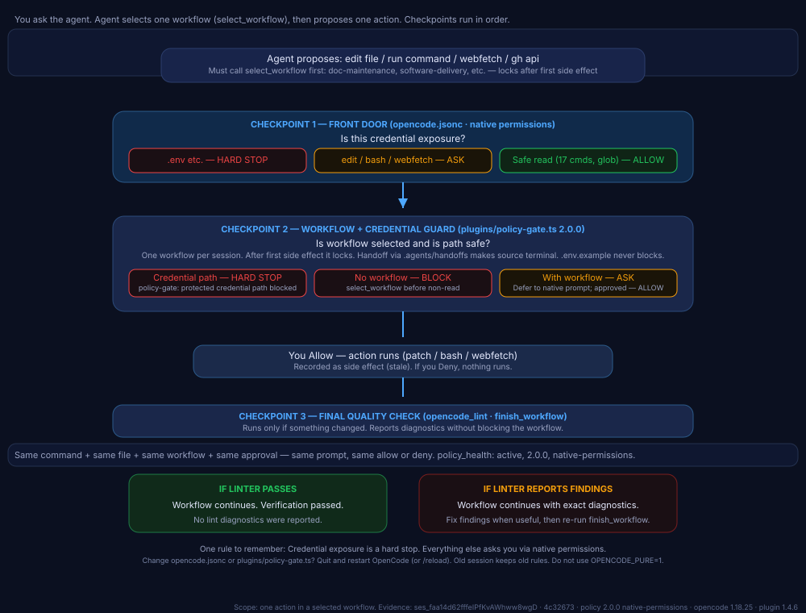

# How our enforcements work — plain terms

> For product and design. No code knowledge needed.

## The idea in one sentence

Every action the agent tries — editing a file, running a command, updating a Gist — goes through the same three checkpoints in the same order, and always gets the same result for the same input. No AI judgment, no randomness.

Think of it like airport security: check-in, security gate, final boarding check. Same ticket, same bag, same result every time.

---

## The three checkpoints

### Checkpoint 1 — The front door (native prompt)

**File:** `opencode.jsonc`

This asks: *should we even let the agent try this?*

- **Credential files like `.env` → hard stop.** No prompt, no override. This is the only hard stop left.
- **Everything else → ask you.** `gh gist edit`, `git push --force`, `python`, `pip`, `docker`, creating or editing any normal file — you see a prompt: Allow or Deny.
- **Safe reads → allow.** `git status`, `uv`/`uvx`, `rg` just run.

**Why this matters:** Before the fix, many actions were hard stops with no prompt. A Gist update could not even reach you for approval. Now you get asked.

### Checkpoint 2 — The workflow guard (project policy)

**File:** `plugins/policy-gate.ts`

This asks: *is this action expected for the job you picked?*

1. **Pick one job per session.** Example: `doc-maintenance` for a Gist edit, `software-delivery` for a feature. Some jobs are read-only, some allow remote changes. Once you make a change, you cannot switch jobs.
2. **Is it a credential path? → hard stop.** Same as checkpoint 1. Never ask.
3. **Is it a normal policy rule? → ask you instead of blocking.** For example, trying a remote Gist edit inside a read-only job used to be blocked. Now the guard steps aside and lets Checkpoint 1 ask you.
4. **Did we read before editing?** The guard remembers what you read and expects a fresh read before a patch. This is also now an ask, not a hard block.

**Real example — Gist update that used to fail:**

1. You or the agent pick `doc-maintenance`.
2. Agent prepares `/tmp/opencode/.../mini-pc-minecraft-ubuntu-retro-notes.md` (draft).
3. Agent runs `gh gist edit 9a143845bc14997da2ada202e4700abf --add note.md`.
4. **Old behavior:** step 2 and 3 were blocked with no prompt — even though you wanted it.
5. **New behavior:** step 2 and 3 show a prompt. You approve once, it runs, then we verify the remote Gist content.

### Checkpoint 3 — The final quality check

**File:** `opencode_lint` + `.pre-commit-config.yaml`

This asks: *did we leave the project in good shape?*

Before a job can close (`finish_workflow`), we run the linter on the whole project. It must pass. There is no prompt here — it reports pass or fail. Warnings are allowed, errors are not. Pre-commit runs a fast version of the same check on every commit.

---

## Deterministic = same input, same outcome

- Same command + same file + same job + same approvals → same prompt, same allow/deny.
- No call to the model, no network decision.
- Restart is required after changing `opencode.jsonc` or `plugins/policy-gate.ts`. The old session keeps the old rules in memory. Use `/reload` or restart OpenCode.

## Where to look when something is blocked

| You see | Why | What to do |
|---|---|---|
| No prompt, message says `protected credential path blocked` | Credential file (`.env`, `.npmrc`, keys) | Do not bypass — use env vars or `pydantic-settings` |
| Prompt appears (Allow / Deny) | Normal policy rule (`gh gist edit`, `python`, file edit) | Allow if you intended it, Deny if not |
| `finish_workflow blocked` after edits | Linter failed | Fix the `LNT` errors it lists, then finish again |

## Visual

- Interactive diagram: `docs/enforcement-flow.html` — open in a browser.
- Static image for GitHub: `docs/enforcement-flow.svg`

```

```

Open the HTML for the full interactive version with hover details.

## One rule to remember

> **Credential exposure is a hard stop. Everything else asks you.**
