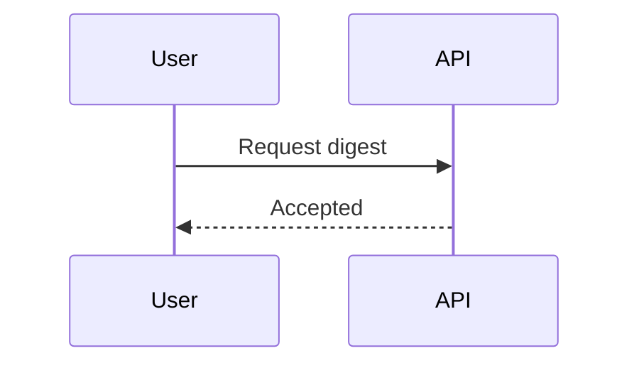

# Software Diagram Output Contract

## Shared Rules

- Give the diagram a clear title that names the view and scenario.
- Include a short scope summary and state assumptions or unknowns.
- Prefer one focused question per diagram. Split large views instead of
  shrinking labels or adding unrelated detail.
- Use consistent names across nodes, messages, states, and data entities.

## HTML

- Use a dark background, clear contrast, and a readable monospace or sans-serif
  font.
- Use inline SVG. Do not depend on external stylesheets or image files.
- Use labeled boxes for systems and containers, cylinders for databases, and
  explicit boundaries for trust or system boundaries.
- Use arrowheads and relationship labels. Avoid crossing arrows when a clearer
  layout is possible.
- For sequence diagrams, place participants across the top, use vertical
  lifelines, and draw messages in top-to-bottom time order. Make synchronous
  calls, responses, asynchronous messages, and branches visually distinct.
- Use a viewBox suited to the diagram: approximately `1000 x 600` for System
  Context and `1000 x 800` for Container or Component views.
- Include a title, legend, and a short summary of scope.

## SVG

- Produce a static SVG equivalent to the HTML diagram.
- Keep the file self-contained. Do not use scripts, external stylesheets,
  external images, external fonts, or `foreignObject`.
- Use a useful `viewBox`, readable text, and a `<title>` or `<desc>` element.
- Use basic SVG shapes, paths, text, arrowheads, and inline presentation
  attributes or styles.
- Preserve the same labels, relationships, colors, boundaries, and layout
  hierarchy as the HTML version.

## GitHub Markdown

- Embed the static SVG with a repository-relative Markdown image reference:

```md

```

- Link to the HTML version only when it is hosted, for example through GitHub
  Pages. Do not rely on a full HTML document, inline CSS, JavaScript, or an
  iframe rendering inside GitHub Markdown.
- Keep the SVG and HTML versions visually and semantically equivalent.

## Mermaid

Use Mermaid only when the user explicitly requests it or requests native
GitHub Mermaid rendering. Put the source in a fenced `mermaid` block:

````md

````

Keep Mermaid source semantically equivalent to the HTML and SVG diagrams.

## C4 Levels

```text
L1 System Context: people, the system, and external systems
L2 Container: deployable applications and data stores inside the system
L3 Component: logical components inside one container
```

Do not include implementation details that do not help explain the selected
level.
